# nextask

[](https://go.dev) [](https://github.com/TolgaOk/nextask) [](https://github.com/TolgaOk/nextask) 

Manage your runs from one place. `nextask` is a **distributed** task queue with live log streaming and git-based source snapshotting for full **reproducibility**.

## Install

```sh
curl -fsSL https://raw.githubusercontent.com/TolgaOk/nextask/main/install | bash
```

## Usage

Enqueue tasks, start workers to pick them up, monitor the outputs and states, organize tasks with tags, and more.


```sh
# Enqueue
nextask enqueue "echo hello"                            # add task to queue
nextask enqueue "service.sh" --tag service=web          # add tag(s)
nextask enqueue "python train.py" --snapshot --attach   # snapshot the source + watch live
```
- `--snapshot` captures your **local** source code and lets (possibly remote) workers execute it at enqueue time.
- `--attach` streams the task output until the task exits.
- `--tag` adds key=value metadata for filtering and routing.

```sh
# Workers
nextask worker                                          # start a worker
nextask worker --filter gpu=a100                        # only matching tags
nextask worker list                                     # list workers
nextask worker stop <workerId>                          # stop worker
```
- `--filter` only runs tasks that have matching tags.
- `--exit-if-idle <time>` stops the worker after being idle for `<time>`.
- `--once` stops the worker after the first task.

```sh
# Monitor
nextask list --status running --tag sweep=exp3          # list & filter tasks
nextask log <taskId> --attach                           # stream live output
nextask show <taskId>                                   # task details
nextask cancel <taskId>                                 # cancel task
```

See `nextask <command> --help` for all options and `nextask --help` for all commands.

## Agent Ready

`nextask` is agent ready by design. Install the [skills](skills/) to let agents set up services, deploy workers, and manage tasks:

```sh
npx skills add https://github.com/TolgaOk/nextask/skills
```

**Example**: Agents can **wait** for all tasks to finish:
```sh
# Run a learning rate sweep over 0.1, 0.01, 0.001.

for lr in 0.1 0.01 0.001; do
  nextask enqueue "python train.py --lr $lr" --snapshot --tag exp=sweep,lr=$lr
done

nextask wait --tag exp=sweep        # block until all `exp=sweep` tasks are finished
```

**Parallel monitoring**: When agents enqueue long-running tasks, you can monitor progress independently: stream logs, check status, and track results without interrupting the agent's workflow.

**Resource management**: Tasks are serialized through a queue, so agents can enqueue many tasks without overloading workers.

## How it works



### Workers

Workers claim tasks atomically. Heartbeats detect stale workers. `--filter` routes tasks by tag. Task statuses: `pending` → `running` → `completed` | `failed` | `cancelled` | `stale`.

Workers can also run inside **containers**. Use tags to route tasks to the right image:

```sh
# each worker picks up tasks matching its --filter
docker run pytorch-cuda:latest nextask worker --filter image=pytorch-gpu
docker run gemma4:latest nextask worker --filter image=gemma

# enqueue a task routed to the right worker
nextask enqueue "python myscript.py" --tag image=pytorch-gpu
```

### Logs

Task outputs are captured in batch with stdout/stderr separation. `--attach` streams output in real-time.

### Snapshots

`--snapshot` captures the full working tree (branch, commit, and uncommitted changes) and pushes to a configured git remote **without modifying your local repo**.

Each task is executed in its own cloned workdir. You can access the source code of each task by its branch name (`<taskId>`).

> **Note:** The git remote used by `nextask` for snapshots is separate from your project's git remotes. It does not affect your local repo or its remotes.

## Configuration

Config files:

```
~/.config/nextask/global.toml            # global defaults
.nextask.toml                            # per-project
```

>**Priority:** CLI flags > ENV vars > `.nextask.toml` > `global.toml`.

Example config:

```toml
[db]
url = "postgres://user@localhost:5432/nextask"   # or NEXTASK_DB_URL

[source]
remote = "~/.nextask/source.git"                 # bare repo as git remote

[worker]
workdir = "/tmp/nextask"                         # or NEXTASK_WORKER_WORKDIR
heartbeat_interval = "1m"                        # how often workers ping
stale_threshold = 3                              # missed heartbeats before stale
log_flush_lines = 100                            # batch size before flushing to DB, OR
log_flush_interval = "500ms"                     # max wait before flushing to DB
log_buffer_size = 10000                          # channel buffer for log lines
```

