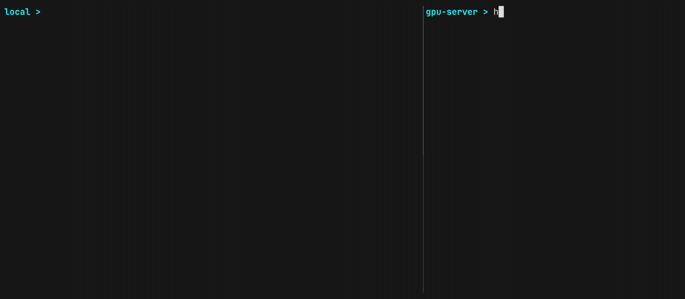

# nextask

[](https://go.dev) [](https://github.com/TolgaOk/nextask) [](https://github.com/TolgaOk/nextask) 

Manage your runs from one place. `nextask` is a distributed task queue with CLI control, live log streaming, and git-based source snapshotting.


## Install

```sh
curl -fsSL https://raw.githubusercontent.com/TolgaOk/nextask/main/install | bash
```

## Usage

Enqueue tasks, start workers to pick them up, monitor output, organize tasks with tags, and more.




```sh
# Enqueue
nextask enqueue "echo hello"                            # add task to queue
nextask enqueue "python train.py" --snapshot --attach   # snapshot the source + watch live

# Workers
nextask worker                                          # start picking up tasks
nextask worker --filter gpu=a100                        # only matching tasks

# Monitor
nextask list --status running --tag sweep=exp3          # filter tasks
nextask log <id> --attach                               # stream live output
nextask show <id>                                       # task details
nextask cancel <id>                                     # cancel task
```

Workers can also run inside containers. Use tags to route tasks to the right image:

```sh
docker run pytorch-cuda:latest nextask worker --filter image=pytorch-gpu
```

### Agent Ready

`nextask` is agent ready by design. Install the [skills](skills/) to let agents set up services, deploy workers, and manage tasks:

```sh
npx skills add https://github.com/TolgaOk/nextask/skills
```

Agents can wait for `all` or `any` tasks that have the given tag to finish:
```sh
# Run a learning rate sweep over 0.1, 0.01, 0.001.

for lr in 0.1 0.01 0.001; do
  nextask enqueue "python train.py --lr $lr" --snapshot --tag sweep=lr --tag lr=$lr
done

nextask wait --tag sweep=lr                         # block until all finish
```

See `nextask <command> --help` for all options and `nextask --help` for all commands.

## How it works

Simplified architecture:

```
                                                           ┌──────────────┐
  ┌──────────────┐                                        ┌──────────────┐│
 ┌──────────────┐│   logs     ┌────────────┐    logs     ┌──────────────┐││
 │              ││◀───────────│ PostgreSQL │◀────────────│    worker    │││
 │    nextask   ││            │   queue    │             │   (remote)   │││
 │      CLI     ││  enqueue   │            │   claim     │              ││┘
 │              │┘─────────┬─▶│  ○ tasks   │──┬─────────▶│   execute    │┘
 └──────────────┘          │  │  ○ logs    │  │          └──────────────┘
                           │  │  ○ workers │  │
                           │  └────────────┘  │
                --snapshot │                  │ clone
                           │  ┌────────────┐  │
                           └─▶│ git remote │──┘
                              └────────────┘
```

>**Workers** claim tasks atomically. Heartbeats detect stale workers. `--filter` routes tasks by tag. Task statuses: `pending` → `running` → `completed` | `failed` | `cancelled` | `stale`.

>**Logs** are captured in batch (see `config`) with stdout/stderr separation. `--attach` streams output in real-time.

>**Snapshots** (`--snapshot`) capture the full working tree (branch, commit, and uncommitted changes) and push to a configured git remote **without modifying your local repo**. Each task is executed in its own cloned workdir.

You can access the source code of each task by the \<taskID\> (branch name).

## Configuration

Config files:

```
~/.config/nextask/global.toml            # global defaults
.nextask.toml                            # per-project
```

>**Priority:** CLI flags > ENV vars > `.nextask.toml` > `global.toml`.

Example config:

```toml
[db]
url = "postgres://user@localhost:5432/nextask"   # or NEXTASK_DB_URL

[source]
remote = "~/.nextask/source.git"                                  # bare repo
# remote = "http://<user>:<token>@gitea:3000/user/snapshots.git"  # gitea / github
# remote = "git://192.168.1.10/snapshots.git"                     # git daemon

[worker]
workdir = "/tmp/nextask"                         # or NEXTASK_WORKER_WORKDIR
heartbeat_interval = "1m"                        # how often workers ping
stale_threshold = 3                              # missed heartbeats before stale
log_flush_lines = 100                            # batch size before flushing to DB, OR
log_flush_interval = "500ms"                     # max wait before flushing to DB
log_buffer_size = 10000                          # channel buffer for log lines
```

