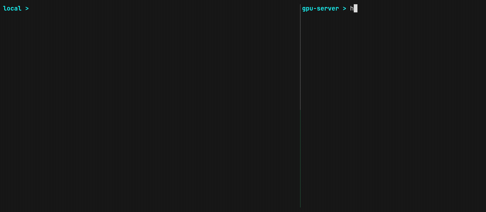

# `nextask`

[](https://go.dev) [](https://github.com/TolgaOk/nextask) [](https://github.com/TolgaOk/nextask)

Run commands on distributed workers with live logs, task status, and optional integrations. Git captures and restores source snapshots; S3 uploads selected task files to object storage.

## Install

```sh
curl -fsSL https://raw.githubusercontent.com/TolgaOk/nextask/main/install | bash
```

## Usage

Enqueue tasks, start workers to process them, monitor their output and status, and organize them with tags.

The example below shows the local CLI in the left pane and a worker running on a remote machine in the right pane.



See `nextask <command> --help` for all options and `nextask --help` for all commands.

Supply an ID with `nextask enqueue --id export-42 'echo ready'`, or omit `--id`
to generate one. IDs contain 1–53 ASCII letters, digits, underscores or hyphens,
starting with a letter or digit. Duplicate IDs are rejected before snapshot work.

Task commands receive `NEXTASK_TASK_ID` and `NEXTASK_DB_URL` from their worker,
overriding inherited values. Use these to pass task identity and the worker's database
connection to independently usable tools. Other environment variables are inherited.

## Agent-ready

`nextask` is agent-ready by design. Install the [skills](skills/) to let agents set up services, deploy workers, and manage tasks:

```sh
npx skills add https://github.com/TolgaOk/nextask/skills
```

**Parallel monitoring.** Monitor logs, check task statuses, and track results without interrupting the agent's workflow.

**Resource management.** Tasks are serialized through a queue, so agents can enqueue many tasks without overloading workers.

## How it works

`nextask` connects a CLI and distributed workers through PostgreSQL. Optional integrations prepare executable task commands. The built-in Git integration uses a separately configured Git remote.


## Configuration

Config files:

```
~/.config/tasktools/config.toml          # optional shared user config
~/.config/nextask/global.toml             # Nextask user config
.tasktools.toml                          # optional shared project config
.nextask.toml                            # Nextask project config
```

Priority is CLI flags, environment variables, project files, user files, then
built-in defaults. Within each scope, the Nextask file overrides the shared
`[nextask]` section, which overrides shared `[defaults]`. Project files are read
from the current directory. Missing files are optional.

Example config:

```toml
[db]
url = "postgres://user@localhost:5432/nextask"   # or NEXTASK_DB_URL

[integrations.git]
remote = "snapshots"                            # existing Git remote name, URL, or path; or NEXTASK_GIT_REMOTE

[worker]
workdir = "/tmp/nextask"                         # or NEXTASK_WORKER_WORKDIR
heartbeat_interval = "1m"                        # worker heartbeat frequency
stale_threshold = 3                              # missed heartbeats before marking a worker stale
log_flush_lines = 100                            # flush after this many lines
log_flush_interval = "500ms"                     # maximum time between flushes
log_buffer_size = 10000                          # log-line channel capacity
```

Shared config uses the same Nextask sections under `[nextask]`:

```toml
[defaults]
db_url = "postgres://user@localhost:5432/tasktools"

[nextask.worker]
workdir = "~/tasks"

[nextask.integrations.git]
remote = "ssh://git@server/snapshots.git"

# Optional Nextask-specific override of defaults.db_url:
# [nextask.db]
# url = "postgres://user@localhost:5432/nextask"
```

Nextask reads only shared defaults and its own section. Standalone Nextask config
continues to work without a shared file or companion tools. Relative paths resolve
from the current directory; `~/` expands to the current user's home. Empty
environment variables are ignored. For core settings, zero numeric or duration values select the built-in defaults.
Integration options have their own validation and zero-value behavior.

```sh
nextask config show --sources
```

This prints effective values and their origins. `nextask config` also shows
effective values. Credentials, URL query values, and fragments are redacted;
keyword-style database connection strings are hidden entirely.

Tools may use the worker's `NEXTASK_TASK_ID` as their own caller-supplied ID and
`NEXTASK_DB_URL` as their database connection. They own their tables and migrations.
The join key in Nextask is `tasks.id`; task metadata includes `command`, `status`,
`tags`, `exit_code`, `created_at`, `started_at`, and `finished_at`. No Nextask foreign
key is required in another tool's tables.

## Integrations

All integrations are disabled by default. Git and S3 ship with Nextask; select
each with `--with TOOL`. Config only supplies integration options.
Plain tasks work without Git. Install Git on the submitter and workers for Git tasks,
and configure a remote both machines can reach using their own Git credentials.

```sh
nextask enqueue --with git --set git.remote=snapshots './job.sh'
nextask enqueue --with git './job.sh'        # use the configured remote
nextask enqueue 'echo hello'                 # plain task
nextask enqueue --with git --set git.remote=archive './job.sh'
nextask worker
```

`--with TOOL` is repeatable, preserves order, and removes duplicates. `--set`
accepts repeatable `TOOL.KEY=VALUE` overrides and requires that tool to be selected.
Names and options are validated before preparation. TOML options use native types;
`--set` lists use JSON arrays and replace the configured list. Repeated assignments
use the last value. Config cannot enable an integration.

Enqueue reserves the task ID, prepares integrations, then publishes the task.
Preparation failure rolls back the task; resources already published before a later
failure remain at their remote. Integrations wrap commands in reverse order so the
first selected integration runs outermost. The original command remains visible in
task listings; the separate execution command contains setup and any finalization.

Git snapshots the repository root, including current tracked file contents,
deletions, and non-ignored untracked files. Staged files are captured as they exist
on disk. Symlinks and executable modes are preserved. File bytes are stored without
running Git clean filters. Submodules and special files are currently rejected.
The repository needs an initial commit and a directory name valid in a Git ref.

All snapshot objects, index entries, and refs are written to temporary storage.
The local working tree and `.git` remain unchanged. Publication creates
`refs/heads/<project>/<TASK_ID>` and refuses an existing snapshot ref. The worker
fetches that ref, checks out the recorded commit in detached HEAD state, and runs
the payload from the task directory. A missing commit fails the task before the
payload starts. The worker checkout has an `origin` remote for explicit Git use.

Cancellation reaches the wrapper and its children through the worker's process
group. Wrappers declare cleanup time, which the worker adds to its stop deadline.
Git has no finalization step. Other integrations must wait for their children
and finalization, and report finalization errors through the command's exit status.
Snapshot capture reads files over time; avoid concurrent file edits during enqueue
when a consistent snapshot is required.

### S3 storage

Configure a destination and explicit file selection in `.nextask.toml`:

```toml
[integrations.s3]
endpoint = "https://fsn1.your-objectstorage.com"
region = "fsn1"
remote = "s3://my-bucket/my-project"
include = ["outputs/**"]
exclude = ["**/*.tmp"]
final_include = ["reports/**"]
interval = "60s"
```

Set `S3_ACCESS_KEY` and `S3_SECRET_KEY` on the worker. These are object-storage
credentials, not a provider's general API token. No separate storage CLI is needed.
The bucket must already exist. Shared config uses `[nextask.integrations.s3]`.

```sh
nextask enqueue --with s3 './job.sh'
nextask enqueue --with git --with s3 './job.sh'
nextask enqueue --with s3 --set s3.interval=0s './job.sh' # final upload only
nextask enqueue --with s3 --set 's3.include=["exports/**","summary.json"]' './job.sh'
```

Files upload to `<remote>/<TASK_ID>/<relative-path>`. Changed content replaces the
same object key; unchanged content is skipped. Final sync runs on success, failure,
and graceful cancellation with a bounded deadline. Abrupt instance loss preserves
only uploads already completed. Removing a task keeps its stored objects.

See the [S3 guide](doc/s3.md) for all options, defaults, limits, and error handling.

## Upgrading to 0.2.0

Run `nextask init db` to add execution-command and cleanup-timeout columns, and upgrade workers before
enqueueing integrated tasks. Older workers reject the new command source type.
Existing queued Git tasks with a recorded commit are translated into the same
restoration command by the new worker. Tasks without a recorded commit fail with a
re-enqueue instruction rather than running a moving branch tip.

`--snapshot` and `--remote` remain deprecated aliases for `--with git` and
`--set git.remote=...`. Existing `source.remote` and `NEXTASK_SOURCE_REMOTE` settings
are accepted. The canonical setting wins over its alias in the same file;
`NEXTASK_GIT_REMOTE` wins over the old environment variable.

`nextask remove` deletes the task and its logs. Snapshot retention is explicit;
remove a remote snapshot with `git push snapshots --delete <project>/<TASK_ID>`.
